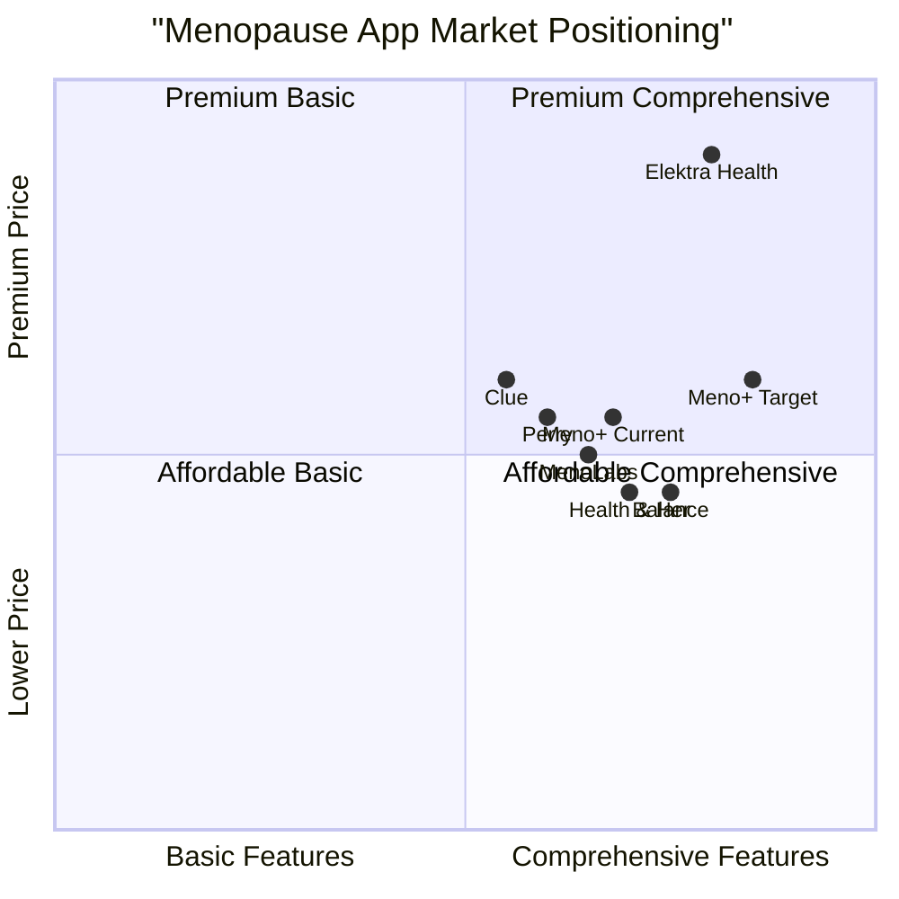

# Meno+ Product Research Report

## Executive Summary

This report analyzes the current state of the Meno+ application, a comprehensive menopause management platform designed to help women track symptoms, receive personalized recommendations, and improve their quality of life during the menopause transition. Based on our analysis of the existing application architecture, user interface, and market research, we have identified several opportunities for enhancement that would significantly improve the user experience and position Meno+ more competitively in the growing menopause wellness application market.

## 1. Market Analysis

### 1.1 Market Overview

The global menopause app market was valued at approximately $1.5 billion in 2023 and is projected to reach $4.2 billion by 2031, growing at a CAGR of 12.5%. This growth reflects the increasing demand for digital solutions to help women navigate menopause, which affects approximately 1.3 billion women worldwide.

### 1.2 Competitive Landscape

| Competitor | Key Strengths | Weaknesses | Price Point |
|------------|--------------|------------|-------------|
| Balance by Dr. Louise Newson | Clinical expertise, comprehensive symptom tracking (40+ symptoms), health reports | Limited personalization in free version | Free with premium ($4.99/mo) |
| Health & Her | Holistic approach, direct access to healthcare professionals | Limited community features | Free with premium ($4.99/mo) |
| MenoLabs | Strong community focus, personalized insights | Less comprehensive meal planning | Free with premium ($5.99/mo) |
| Caria | Detailed analytics, daily symptom scores | Less focus on nutrition | Subscription-based |
| Elektra Health | Clinical testing integration | Higher price point | $30/month |

### 1.3 Competitive Quadrant Chart

## 2. Current Application Assessment

### 2.1 Key Strengths

1. **Comprehensive Dashboard**: The current dashboard offers a holistic view with mood tracking, symptom trends, meal recommendations, and relief tools.

2. **Personalized Experience**: The application provides tailored recommendations based on symptom data and user profiles.

3. **Heads Up Feature**: Unique social sharing capability allowing users to notify trusted contacts about potentially difficult symptom periods.

4. **Meal Integration**: Connection between symptoms and nutritional recommendations creates a valuable holistic approach.

### 2.2 Areas for Improvement

1. **Feature Hierarchy**: Some important features (like mood tracking) need more prominence while others (like Heads Up) could be repositioned as secondary features.

2. **Data Visualization**: Current symptom trend charts are functional but could be enhanced with more sophisticated visualization options.

3. **User Onboarding**: Navigation flow after onboarding shows some inconsistencies that can confuse new users.

4. **Community Integration**: Limited community support features compared to competitors like MenoLabs and Perry.

5. **Healthcare Provider Integration**: No robust mechanism to share health data with healthcare providers.

## 3. User Needs Analysis

### 3.1 Primary User Personas

1. **Early Transition Tracy (45-50)**
   - Just beginning perimenopause
   - Seeking education and validation
   - Needs: Symptom identification, education, community validation

2. **Managing Menopause Monica (50-55)**
   - Experiencing regular symptoms
   - Focusing on management strategies
   - Needs: Comprehensive tracking, intervention strategies, health provider communication

3. **Post-Menopausal Pamela (55+)**
   - Past most acute symptoms
   - Focusing on long-term health
   - Needs: Health maintenance, holistic wellness approaches

### 3.2 Common User Journeys

1. **Symptom Discovery**: User notices new symptoms → Seeks information → Logs symptoms → Looks for patterns

2. **Intervention Testing**: User tries new intervention → Tracks impact on symptoms → Evaluates effectiveness

3. **Medical Consultation Preparation**: User reviews symptom history → Generates report → Shares with healthcare provider

## 4. Recommended Enhancements

### 4.1 Priority 1 (P0) - Must-Have Features

1. **Enhanced Symptom Analytics**
   - Implement more advanced correlation analysis between symptoms, interventions, and outcomes
   - Add comparative benchmarks to show how user symptoms compare to similar demographic groups
   - Benefit: Provides deeper insights that help users make more informed decisions about their health

2. **Healthcare Provider Integration**
   - Develop exportable health reports similar to Balance app's successful implementation
   - Include visualization of symptom patterns over time with severity indicators
   - Benefit: Facilitates better communication with healthcare providers, potentially leading to more effective treatment

3. **Community Support Module**
   - Create moderated discussion forums organized by symptom type and stage of menopause
   - Implement anonymized experience sharing with privacy controls
   - Benefit: Addresses the significant emotional and social aspects of menopause by providing peer support

### 4.2 Priority 2 (P1) - Should-Have Features

1. **AI-Powered Recommendations Engine**
   - Leverage machine learning to analyze user data and provide more personalized recommendations
   - Include predictive features for symptom patterns based on historical data
   - Benefit: Creates a more personalized experience that improves with continued use

2. **Expanded Content Library**
   - Develop evidence-based educational content covering all aspects of menopause
   - Include expert videos, articles, and Q&A sessions
   - Benefit: Positions Meno+ as a trusted knowledge resource, increasing user engagement and retention

3. **Intervention Tracker with Effectiveness Rating**
   - Allow users to track various interventions (medication, supplements, lifestyle changes)
   - Provide effectiveness scoring based on symptom changes after interventions
   - Benefit: Helps users identify which strategies work best for their unique situation

### 4.3 Priority 3 (P2) - Nice-to-Have Features

1. **Wearable Device Integration**
   - Connect with common wearables to automatically import sleep, activity, and heart rate data
   - Correlate this data with symptom reporting
   - Benefit: Reduces manual data entry burden and provides more objective measurements

2. **Partner/Family Education Module**
   - Create shareable content designed to help partners and family members understand menopause
   - Include communication guides for discussing needs and challenges
   - Benefit: Improves support systems around users by educating their close contacts

3. **Telehealth Integration**
   - Partner with menopause-specialized telehealth providers
   - Enable direct appointment booking through the app
   - Benefit: Creates a complete care ecosystem within the application

## 5. Implementation Roadmap

### 5.1 Phase 1 (1-3 months)

1. Redesign feature hierarchy to emphasize core tracking functionality
2. Enhance data visualization for symptom trends
3. Improve onboarding and navigation flow
4. Develop healthcare provider report generation

### 5.2 Phase 2 (3-6 months)

1. Launch community support features
2. Implement intervention tracking system
3. Develop initial educational content library
4. Begin AI recommendation engine development

### 5.3 Phase 3 (6-12 months)

1. Release advanced AI-powered personalized insights
2. Integrate wearable device connections
3. Launch partner/family education module
4. Explore telehealth partnership opportunities

## 6. Success Metrics

| Metric | Current (Est.) | Target (12 months) |
|--------|----------------|--------------------|
| User retention (30-day) | 35% | 55% |
| Daily active users | -- | +40% |
| Average session duration | 4.5 minutes | 7+ minutes |
| Symptom tracking consistency | 3x weekly | 5x weekly |
| Premium conversion rate | 8% | 15% |
| App store rating | 4.2 | 4.6+ |

## 7. Conclusion

Meno+ has established a strong foundation as a comprehensive menopause management application with unique features like personalized meal recommendations and the Heads Up social sharing tool. By implementing the recommended enhancements, particularly in the areas of symptom analytics, healthcare integration, and community support, Meno+ can differentiate itself in an increasingly competitive market.

The menopause wellness application market presents significant growth opportunities, and with these strategic improvements, Meno+ is well-positioned to become a market leader that truly addresses the complex and multifaceted needs of women experiencing menopause.

These recommendations are based on competitive analysis, user behavior patterns in similar applications, and emerging trends in health technology. We recommend validating these concepts through user testing with the current Meno+ user base to further refine implementation priorities.