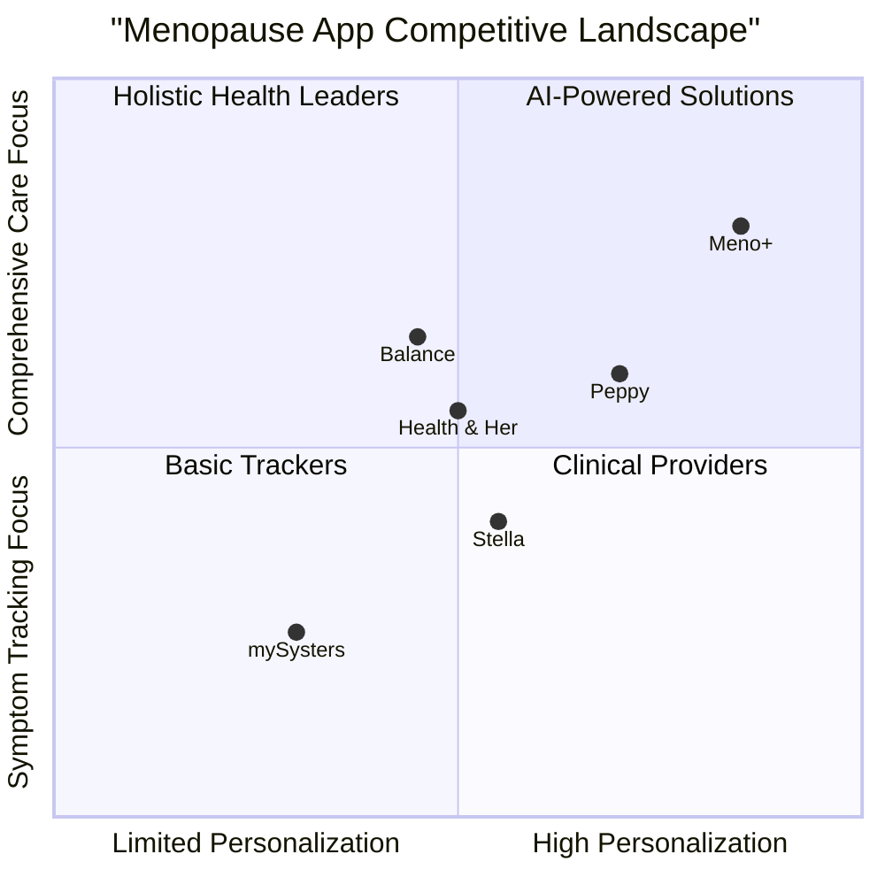

# Meno+ Product Requirements Document

## 1. Project Overview

### 1.1 Introduction

Meno+ is an AI-powered web application designed to support women experiencing perimenopause and menopause through personalized, food-first care. The platform aims to provide adaptive nutrition guidance, symptom tracking, and relief tools in an emotionally supportive and user-friendly interface.

### 1.2 Original Requirements

Meno+ helps women manage menopause symptoms through personalized weekly meal plans, micronutrient coaching, and relief tools, powered by AI. No calorie counting or logging—just relevant, timely support.

**Required Features:**
1. Onboarding & Personalization
2. Dashboard (Home)
3. Meal Plan Page
4. Relief Tools
5. Symptom Trends & Feedback
6. Voice Concierge (Beta)

### 1.3 Technology Stack

- Frontend: React, JavaScript, Tailwind CSS
- Backend: Serverless architecture with API integrations
- AI Integration: GPT-4o for meal generation
- Voice Technology: ElevenLabs
- Data Storage: Firestore
- Integration Services: n8n or Make.com for automation

## 2. Market Research

### 2.1 Market Size and Opportunity

The global menopause app market is valued at approximately $1.5-1.8 billion in 2024, with projections to reach $4.2 billion by 2031, growing at a CAGR of 12.5-15%. This growth is driven by several factors:

- **Demographic Shift**: By 2030, around 1.2 billion women worldwide will be experiencing menopause (12% of the global population)
- **High Symptom Prevalence**: Approximately 75% of menopausal women experience symptoms that impact their quality of life
- **Growing Awareness**: Increasing recognition of menopause and its symptoms
- **Technological Adoption**: Widespread use of smartphones and health apps

The broader women's health app ecosystem is valued at $4.3-4.7 billion in 2024, with menopause-specific applications representing a growing segment addressing a previously underserved demographic.

### 2.2 Competitive Analysis

| App | Primary Focus | Key Features | Differentiators | Limitations |
|-----|---------------|--------------|-----------------|-------------|
| Balance | Holistic menopause management | Symptom tracking, educational content, community | Comprehensive approach | Limited personalization |
| Peppy | Healthcare connection | Personalized coaching, access to specialists | Direct connection to healthcare providers | Subscription cost barrier |
| Stella | Clinical services | Online clinic, HRT options | Clinical care integration | Less focus on lifestyle management |
| mySysters | Community support | Symptom tracking, forums | Strong peer network | Limited nutrition guidance |
| Health & Her | Product recommendations | Tracking, education, marketplace | Product integration | Potential conflict of interest |

### 2.3 Competitive Quadrant Chart

### 2.4 Key Market Insights

1. **Nutritional Focus Gap**: Most existing solutions focus on symptom tracking or medical interventions, with limited personalized nutritional guidance for menopause symptoms

2. **AI Utilization**: Only about 30% of menopause apps effectively use AI for personalized health insights

3. **Holistic Care Trend**: Users increasingly seek comprehensive solutions that address multiple aspects of menopause

4. **Privacy Concerns**: Women report concerns about data privacy in health tracking apps

5. **User Experience Importance**: Simplicity and emotional support in UX design are critical for this demographic

## 3. User Personas

### 3.1 Persona 1: Transitioning Tricia (Perimenopause)

- **Age**: 45-48
- **Occupation**: Marketing executive
- **Primary Symptoms**: Irregular periods, occasional hot flashes, sleep disruption, mood swings
- **Secondary Concerns**: Weight gain around midsection, decreased energy levels
- **Technology Comfort**: High, uses fitness tracker and nutrition apps
- **Goals**: Maintain energy levels at work, stabilize mood swings, prevent weight gain
- **Pain Points**: Unpredictability of symptoms, concern about long-term health, difficulty finding reliable information
- **Quote**: "I need to stay on top of my game at work while dealing with these new symptoms that seem to appear randomly."

### 3.2 Persona 2: Managing Melissa (Early Menopause)

- **Age**: 49-52
- **Occupation**: Elementary school teacher
- **Primary Symptoms**: Regular hot flashes, night sweats, insomnia, cognitive fog
- **Secondary Concerns**: Joint pain, digestive changes, anxiety
- **Technology Comfort**: Moderate, uses social media and basic health apps
- **Goals**: Improve sleep quality, reduce hot flash intensity, maintain mental clarity
- **Pain Points**: Disrupted sleep affecting work performance, embarrassment about hot flashes in public
- **Quote**: "I just want to sleep through the night again and not worry about having a hot flash in the middle of teaching."

### 3.3 Persona 3: Adapting Andrea (Post-menopause)

- **Age**: 53-60
- **Occupation**: Semi-retired consultant
- **Primary Symptoms**: Vaginal dryness, occasional hot flashes, mood changes
- **Secondary Concerns**: Bone health, heart health, maintaining vitality
- **Technology Comfort**: Lower, uses smartphone but limited app experience
- **Goals**: Maintain physical activity, protect long-term health, enjoy life
- **Pain Points**: Concern about aging, maintaining intimate relationships, finding reliable health information
- **Quote**: "I want to focus on my long-term health and quality of life, not just treating symptoms."

## 4. Product Goals

### 4.1 Primary Goals

1. **Provide Personalized Nutrition Support**: Deliver AI-generated meal plans tailored to individual menopause symptoms, dietary preferences, and health goals

2. **Reduce Symptom Severity**: Measurably decrease the intensity and frequency of menopause symptoms through targeted nutrition and lifestyle interventions

3. **Create an Emotionally Supportive Experience**: Develop an interface and content approach that acknowledges the emotional aspects of menopause and provides validation and encouragement

### 4.2 User Stories

1. **As a perimenopausal woman**, I want personalized meal suggestions that target my specific symptoms, so that I can proactively manage my health through nutrition.

2. **As a woman experiencing hot flashes**, I want easy access to relief tools during acute symptom episodes, so that I can quickly implement coping strategies.

3. **As a busy professional**, I want simplified meal planning that addresses my health needs without requiring extensive time commitment, so that I can maintain my health while balancing work responsibilities.

4. **As a woman concerned about long-term health**, I want to understand which micronutrients I need during menopause, so that I can protect my bone density and cardiovascular health.

5. **As a woman experiencing night wakings**, I want accessible solutions when I wake up at 3 AM, so that I can return to sleep more easily.

## 5. Detailed Feature Specifications

### 5.1 Onboarding & Personalization

#### 5.1.1 Symptom Quiz

**Requirements:**
- Must capture perimenopause/menopause staging using validated screening questions
- Must identify top 3 symptoms from a comprehensive list of common symptoms
- Must assess symptom severity on a 1-5 scale
- Must track symptom frequency (daily, several times weekly, occasional)
- Should use warm, empathetic language throughout

**User Flow:**
1. Welcome screen with brief overview
2. Age and menstrual status questions (P0)
3. Symptom checklist with ability to select multiple (P0)
4. Symptom prioritization to identify top 3 concerns (P0)
5. Symptom severity and frequency assessment (P1)

#### 5.1.2 Dietary Preferences

**Requirements:**
- Must capture basic dietary patterns (omnivore, vegetarian, vegan, etc.)
- Must identify food allergies and intolerances
- Should capture specific diet preferences (Mediterranean, low-carb, etc.)
- Should identify food dislikes and preferences
- May include information about current eating patterns

**User Flow:**
1. Dietary pattern selection (P0)
2. Allergen identification with searchable database (P0)
3. Specific diet preference selection (P1)
4. Food likes/dislikes with quick selection interface (P1)
5. Current eating habits assessment (optional) (P2)

#### 5.1.3 Personal Goals

**Requirements:**
- Must allow selection of primary health goals
- Must connect goals to measurable outcomes
- Should provide realistic timeframes for achievement
- Should balance symptom management with long-term health

**User Flow:**
1. Goal category selection (symptom relief, weight management, energy, etc.) (P0)
2. Specific goal selection within categories (P0)
3. Goal prioritization (P1)
4. Timeline and expectation setting (P1)

#### 5.1.4 First Meal Plan Preview

**Requirements:**
- Must show sample day of meals based on inputs
- Must highlight symptom-nutrition connections
- Should preview key micronutrients addressed
- Should provide swap options to demonstrate flexibility

**User Flow:**
1. Sample day meal preview with visual appeal (P0)
2. Symptom-food connection callouts (P0)
3. Brief explanation of personalization factors (P1)
4. Call-to-action to complete sign-up (P0)

#### 5.1.5 Motivational First-time Screen

**Requirements:**
- Must welcome user with positive, empowering message
- Must preview key features and benefits
- Should set realistic expectations for results
- Should include clear next steps

**User Flow:**
1. Personalized welcome message with name (P0)
2. Brief tour of key features with visual highlights (P0)
3. First action recommendation (P1)
4. Feature discovery prompts (P1)

### 5.2 Dashboard (Home)

#### 5.2.1 Today's Symptom Status

**Requirements:**
- Must display a simplified visual representation of current symptom status
- Must show trend compared to previous days
- Should use color coding for severity (cool to warm colors)
- Should allow quick navigation to detailed symptom history

**UI Elements:**
- Mini graph showing 7-day symptom intensity for top symptoms (P0)
- Color-coded indicators for today's symptom levels (P0)
- Trend indicators (improved, unchanged, worsened) (P1)
- Touch target to expand full symptom history (P1)

#### 5.2.2 "How Are You Feeling?" Check-In

**Requirements:**
- Must provide 1-tap mood and symptom check-in
- Must use emotionally-intelligent language
- Must be prominent on dashboard
- Should adapt follow-up questions based on response

**UI Elements:**
- Large, accessible mood selection buttons with friendly visual design (P0)
- Brief follow-up question based on selection (P0)
- Quick symptom intensity slider for identified top symptoms (P1)
- Supportive feedback message after check-in (P1)

#### 5.2.3 Today's Meal Plan Summary

**Requirements:**
- Must show current day's meals with thumbnail images
- Must highlight key nutritional benefits
- Should indicate which symptoms each meal targets
- Should provide quick navigation to full meal plan

**UI Elements:**
- Visual meal cards with appealing food photography (P0)
- "Helps with" indicators linking meals to symptoms (P0)
- Key nutrient highlights with simple icons (P1)
- One-tap navigation to meal details (P0)

#### 5.2.4 Micronutrient Badge

**Requirements:**
- Must show progress toward daily micronutrient goals
- Must highlight priority nutrients based on symptom profile
- Should provide educational tip about featured nutrient
- May provide supplementation guidance if applicable

**UI Elements:**
- Visual progress indicator for key nutrients (calcium, magnesium, B vitamins, etc.) (P0)
- Today's featured nutrient with brief benefit explanation (P1)
- Source recommendations for featured nutrient (P1)
- Link to nutrient education content (P2)

#### 5.2.5 Relief Tools Shortcut Menu

**Requirements:**
- Must provide quick access to symptom-specific relief tools
- Must prioritize tools based on current symptoms and time of day
- Should include visual indicators for tool categories

**UI Elements:**
- Icon-based relief tool shortcuts (P0)
- Contextual highlighting based on time of day and recent symptoms (P1)
- "SOS" highlighted option for urgent symptom relief (P0)
- Recently used tools section (P1)

#### 5.2.6 Streak Tracker / Motivational Card

**Requirements:**
- Must provide positive reinforcement for app engagement
- Must highlight progress and achievements
- Should use encouraging, non-judgmental language
- Should avoid creating pressure or guilt

**UI Elements:**
- Visual streak tracker with celebration milestones (P1)
- Personalized motivational message (P1)
- Weekly accomplishment summary (P2)
- Small reward or unlock features for consistent engagement (P2)

### 5.3 Meal Plan Page

#### 5.3.1 Weekly Scroll View

**Requirements:**
- Must display 7-day meal plan with easy navigation
- Must clearly indicate current day
- Should allow horizontal scrolling through days
- Should maintain consistent meal categories

**UI Elements:**
- Day selector with visual indicators for current day (P0)
- Meal cards organized by category (breakfast, lunch, dinner) (P0)
- Quick filter options for viewing specific meal types (P1)
- Print/export week's plan functionality (P2)

#### 5.3.2 Meal Detail View

**Requirements:**
- Must show meal details with ingredients and instructions
- Must highlight symptom-relieving properties
- Should include nutritional information
- Should offer serving size adjustments

**UI Elements:**
- Visual presentation of meal with high-quality image (P0)
- Symptom-benefit callout badges (P0)
- Expandable preparation instructions (P0)
- Ingredient list with amounts (P0)
- Nutrition summary with emphasis on relevant micronutrients (P1)
- Serving size adjuster (P1)

#### 5.3.3 Meal Swap Functionality

**Requirements:**
- Must provide alternative meal options while maintaining nutritional targets
- Must respect dietary preferences and restrictions
- Should explain the benefits of recommended alternatives
- Should limit options to prevent decision fatigue

**UI Elements:**
- "Swap" button prominently displayed on meal cards (P0)
- 3-5 alternatives presented with images (P0)
- Nutrition comparison between original and alternatives (P1)
- Reason for recommendation (e.g., "Also high in calcium") (P1)

#### 5.3.4 Save to Favorites

**Requirements:**
- Must allow users to save preferred meals for future reference
- Must provide easy access to favorites collection
- Should allow categorization of favorites

**UI Elements:**
- Heart or bookmark icon on meal detail view (P1)
- Favorites collection accessible from profile or dedicated tab (P1)
- Optional note field for personal adjustments (P2)
- Favorited meal indicator in weekly view (P2)

#### 5.3.5 Grocery Integration

**Requirements:**
- Must generate grocery list from meal plan
- Must support at least one major grocery delivery service API
- Should allow customization of grocery list
- Should detect common pantry items

**UI Elements:**
- "Get Groceries" button on meal plan view (P0)
- Automatically generated shopping list by category (P0)
- Edit/customize list functionality (P1)
- Integration with Instacart, Walmart, or Amazon Fresh (P0)
- Option to exclude items already owned (P1)

### 5.4 Relief Tools

#### 5.4.1 Night SOS

**Requirements:**
- Must provide immediate support for nighttime waking
- Must include calming audio and visual elements
- Must offer guided breathing exercises
- Should adapt to specific nighttime symptoms

**UI Elements:**
- Night-friendly dark interface with minimal blue light (P0)
- Guided breathing visualization (P0)
- Soothing audio options (voice guidance, nature sounds, etc.) (P0)
- Timer options for sleep-promoting exercises (P1)
- Quick symptom selection for targeted recommendations (P1)

#### 5.4.2 Mood Nudges

**Requirements:**
- Must provide in-the-moment support for mood challenges
- Must cover common emotional states (anxiety, irritability, sadness)
- Should include quick CBT-based techniques
- Should acknowledge emotions without judgment

**UI Elements:**
- Emotion selection interface with relatable descriptions (P0)
- Brief (60-90 second) evidence-based interventions per emotion (P0)
- Follow-up check-in after intervention (P1)
- Option to log emotional triggers (P2)

#### 5.4.3 Wind-down Routine Guide

**Requirements:**
- Must provide customizable evening routine recommendations
- Must include options for different time availabilities (5, 15, 30 min)
- Should incorporate sleep hygiene best practices
- Should adapt based on reported sleep quality

**UI Elements:**
- Time-based routine selector (P0)
- Step-by-step guide with timers if needed (P0)
- Sleep-promoting nutrition tips (P1)
- Environment optimization suggestions (P1)
- Progress tracking through routine steps (P2)

#### 5.4.4 Snack Substitution Prompts

**Requirements:**
- Must provide symptom-specific healthy snack alternatives
- Must account for cravings (sweet, salty, etc.)
- Should include simple preparation instructions
- Should explain symptom-management benefits

**UI Elements:**
- Craving type selector (sweet, salty, crunchy, etc.) (P0)
- Visual snack alternatives with simple descriptions (P0)
- Nutritional comparison with conventional snacks (P1)
- "Quick prep" indicator for time-sensitive situations (P1)

#### 5.4.5 Hydration & Movement Nudges

**Requirements:**
- Must provide timely reminders for hydration and movement
- Must include quick movement routines (2-5 minutes)
- Should adapt timing based on user schedule
- Should connect activities to symptom management

**UI Elements:**
- Subtle reminder notifications with immediate actions (P0)
- Quick movement videos or animations (P0)
- Hydration tracker with goal visualization (P1)
- "Done" button with reinforcing feedback (P1)

### 5.5 Symptom Trends & Feedback

#### 5.5.1 Mood + Symptom Visual Timeline

**Requirements:**
- Must provide visual representation of symptom patterns over time
- Must correlate multiple data points (symptoms, mood, nutrition)
- Should identify patterns and potential triggers
- Should use accessible data visualization

**UI Elements:**
- Timeline view with color-coded symptom intensity (P0)
- Overlay options for different data points (P1)
- Pattern identification callouts (P1)
- Date range selector (P0)
- Export/share functionality for healthcare provider visits (P2)

#### 5.5.2 Weekly Meal Adherence Overview

**Requirements:**
- Must provide non-judgmental overview of meal plan adherence
- Must highlight positive correlations between nutrition and symptoms
- Should focus on successful choices rather than missed meals
- Should provide actionable insights for improvement

**UI Elements:**
- Simplified visual summary of meal plan adherence (P1)
- Top beneficial foods consumed in the week (P1)
- Suggested adjustments based on symptom changes (P1)
- Positive reinforcement messaging (P0)

#### 5.5.3 Micronutrient Completion Rings

**Requirements:**
- Must visualize progress toward optimal micronutrient intake
- Must prioritize nutrients relevant to symptom profile
- Should provide context for importance of each nutrient
- Should suggest food sources for incomplete nutrients

**UI Elements:**
- Apple Watch-style completion rings for key nutrients (P0)
- Weekly and monthly view options (P1)
- Educational tooltips for each nutrient (P1)
- Food suggestion cards for undernourished areas (P1)

#### 5.5.4 Optional Reflections and Affirmations

**Requirements:**
- Must provide optional guided reflection prompts
- Must offer positive affirmations related to menopause journey
- Should adapt content based on symptom experiences
- Should allow saving of personal reflections

**UI Elements:**
- Daily reflection prompt (optional engagement) (P2)
- Symptom-specific affirmation cards (P2)
- Private journaling space (P2)
- Option to receive affirmation notifications (P2)

### 5.6 Voice Concierge (Beta)

#### 5.6.1 Conversational AI Assistant

**Requirements:**
- Must provide natural language interface for app interaction
- Must explain nutritional choices and recommendations
- Should offer calm, empathetic voice tone
- Should understand menopause-specific terminology

**Technical Requirements:**
- Integration with GPT-4o for conversation generation (P0)
- ElevenLabs voice synthesis for natural speech (P0)
- Context-awareness of user's history and preferences (P1)
- Fallback mechanisms for misunderstood queries (P0)

#### 5.6.2 Meal Explanation Functionality

**Requirements:**
- Must explain how specific meals address symptoms
- Must provide scientific basis for nutritional recommendations
- Should answer common questions about ingredients
- Should offer substitution suggestions when asked

**Sample Interactions:**
- "Why is this meal good for hot flashes?"
- "What can I substitute for tofu in this recipe?"
- "How does magnesium help with sleep?"
- "Can you suggest a simpler version of this recipe?"

#### 5.6.3 Calming Tips Delivery

**Requirements:**
- Must provide voice-guided breathing and relaxation exercises
- Must offer symptom-specific calming techniques
- Should adapt tone and pace based on situation (e.g., nighttime vs. daytime)
- Should include background ambient options

**Sample Interactions:**
- "Help me calm down right now"
- "I'm having a hot flash"
- "Guide me through a sleep meditation"
- "I need to relax before my meeting"

#### 5.6.4 Smart Speaker Integration

**Requirements:**
- Must support basic functionality through smart speakers
- Must maintain privacy in voice interactions
- Should offer wake-up and wind-down routines
- May provide hands-free recipe instructions

**Technical Requirements:**
- Initial support for Amazon Alexa and Google Home (P1)
- Authentication and security protocols (P0)
- Limited response design for screen-less interaction (P1)
- Clear activation and deactivation commands (P0)

## 6. Technical Architecture

### 6.1 System Components

1. **Frontend Layer**
   - React web application with progressive web app capabilities
   - Tailwind CSS for responsive design
   - Client-side state management

2. **Backend Services**
   - Serverless API endpoints
   - Authentication and user management
   - Recommendation engine
   - Voice processing pipeline

3. **AI Services**
   - GPT-4o integration for meal generation and conversation
   - Machine learning models for symptom pattern recognition
   - ElevenLabs voice synthesis

4. **Data Storage**
   - Firestore for user data and preferences
   - Secure storage for health information
   - Content management system for nutritional information

5. **Integration Layer**
   - n8n or Make.com for third-party service orchestration
   - Grocery delivery API connections
   - OAuth providers for social login

### 6.2 Data Flow

1. **User Onboarding Flow**
   - User profile creation
   - Symptom and preference collection
   - Initial recommendation generation

2. **Meal Generation Flow**
   - Symptoms + preferences → AI meal generation
   - Nutritional validation
   - Presentation and storage

3. **Check-in and Feedback Flow**
   - Daily symptom data collection
   - Correlation with nutrition adherence
   - Pattern recognition and insight generation

4. **Voice Interaction Flow**
   - Speech input → intent recognition
   - Context-aware response generation
   - Voice synthesis and delivery

### 6.3 Security and Privacy

- HIPAA-compliant data storage and transmission
- End-to-end encryption for sensitive health data
- User-controlled data sharing options
- Regular security audits and penetration testing
- Transparent privacy policy with opt-in data usage for improvement

## 7. MVP Definition and Roadmap

### 7.1 MVP Feature Set (Phase 1)

1. **Core Onboarding**
   - Basic symptom assessment
   - Dietary preferences capture
   - Goal setting

2. **Essential Dashboard**
   - Simplified symptom status
   - Daily mood check-in
   - Basic meal plan display

3. **Fundamental Meal Planning**
   - Daily meal recommendations
   - Basic swap functionality
   - Key nutritional information

4. **Priority Relief Tools**
   - Night SOS function
   - Basic mood support
   - Simple hydration tracking

### 7.2 Phase 2 Expansion

1. **Enhanced Personalization**
   - More detailed symptom tracking
   - Learning algorithm for preference refinement
   - Expanded dietary preference options

2. **Grocery Integration**
   - Shopping list generation
   - Initial e-commerce integration

3. **Expanded Relief Tools**
   - Complete wind-down routine
   - Advanced mood support with CBT elements
   - Comprehensive movement suggestions

### 7.3 Phase 3 Expansion

1. **Voice Concierge Beta**
   - Initial voice interaction capability
   - Basic smart speaker integration

2. **Advanced Analytics**
   - Pattern recognition
   - Predictive symptom insights
   - Nutrition-symptom correlation reporting

3. **Community Features**
   - Moderated discussion spaces
   - Expert Q&A sessions
   - Success story sharing

## 8. Success Metrics

### 8.1 User Engagement Metrics

- **Daily Active Users (DAU)**: Target 40% of registered users
- **Session Frequency**: Target 5+ sessions per week
- **Session Duration**: Target 3+ minutes average
- **Feature Adoption**: >70% of users utilizing at least 3 core features

### 8.2 Health Impact Metrics

- **Symptom Improvement**: >40% of users reporting reduced symptom severity within 30 days
- **Sleep Quality**: >50% of users reporting improved sleep within 60 days
- **Nutritional Knowledge**: >60% improvement in nutritional knowledge assessment scores

### 8.3 Business Metrics

- **Conversion Rate**: >8% conversion from free to premium
- **Retention**: >70% 90-day retention for premium users
- **Referral Rate**: >15% of users referring others
- **Affiliate Revenue**: Average $0.20 ARPU from grocery partnerships

## 9. Open Questions and Considerations

1. **Data Privacy Regulations**
   - How will the app handle varying privacy requirements across different regions?
   - What level of anonymization is possible while maintaining personalization?

2. **Scientific Validation**
   - What process will ensure nutritional recommendations are evidence-based?
   - Should we establish a scientific advisory board for content review?

3. **AI Limitations**
   - How will we handle edge cases in meal recommendations for complex dietary requirements?
   - What fallback mechanisms are needed when AI generation fails to meet quality standards?

4. **Voice Technology Considerations**
   - How will we ensure voice features work in noisy environments?
   - What privacy safeguards are needed for voice data collection?

5. **Expansion Possibilities**
   - Should future versions include healthcare provider integration?
   - Is there potential for prescription medication reminders and tracking?

## 10. Conclusion

The Meno+ application addresses a significant gap in the menopause management market by providing personalized, food-first support for women experiencing perimenopause and menopause. By focusing on the key differentiation of AI-powered nutrition recommendations and symptom relief tools within an emotionally supportive interface, Meno+ has the potential to become a daily companion for women during this life transition.

The phased development approach ensures the delivery of a valuable MVP while setting a clear path toward a comprehensive solution. With careful attention to user experience, evidence-based recommendations, and privacy considerations, Meno+ can establish itself as a trusted resource in women's health technology.
